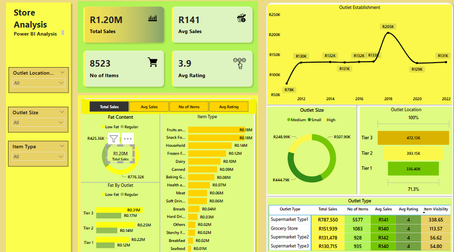

# 🧮 Power BI Sales Performance Dashboard

This project presents a **comprehensive Power BI dashboard** analyzing **sales performance, customer satisfaction, and inventory distribution** across various outlet and product dimensions. The goal is to uncover **key insights** and identify opportunities for **optimization and strategic decision-making** using dynamic visuals and KPIs.

---

## 🎯 Objectives

Conduct a detailed analysis of:
- Total revenue and sales patterns
- Customer satisfaction trends
- Inventory and product distribution
- Performance across outlet types, locations, and product attributes

---

## 📊 KPI Highlights

| Metric             | Description                                             |
|--------------------|---------------------------------------------------------|
| **Total Sales**     | Total revenue generated from all items sold            |
| **Average Sale**    | Average revenue per sale                               |
| **Number of Items** | Total count of items sold                              |
| **Average Rating**  | Average customer rating of sold items                  |

---

## 📈 Visualizations & Insights

| Chart Title                          | Objective                                                                                      | Chart Type        |
|-------------------------------------|-----------------------------------------------------------------------------------------------|-------------------|
| **Total Sales by Fat Content**      | Analyze impact of fat content on sales and related KPIs                                       | Donut Chart       |
| **Total Sales by Item Type**        | Identify sales performance by item category and related KPIs                                  | Bar Chart         |
| **Fat Content by Outlet**           | Compare total sales across outlets segmented by fat content                                   | Stacked Column    |
| **Sales by Outlet Establishment**   | Evaluate how outlet age/type affects total sales                                               | Line Chart        |
| **Sales by Outlet Size**            | Analyze how outlet size correlates with sales                                                  | Donut / Pie Chart |
| **Sales by Outlet Location**        | Understand geographic sales distribution                                                       | Funnel Map        |
| **All Metrics by Outlet Type**      | Consolidated matrix showing all KPIs per outlet type                                           | Matrix Card       |

---

## 🛠 Tools & Technologies

- **Power BI Desktop**
- **Power Query & DAX**
- Excel (data source)
- Data modeling techniques (star schema, measures, calculated columns)

---

## 📷 Dashboard Screenshot

 <!-- Replace with actual screenshot name -->

---

## 📌 Author

**Ellias Sithole**  
📍 Johannesburg, South Africa  
🎓 Mathematics & Data Enthusiast | Power Platform & SQL Developer  
🔗 [LinkedIn](linkedin.com/in/ellias-elijah-sithole-4850b0139) | [Portfolio Website](babakaelijah.github.io/portoflio-website/ )

---

## 📚 License

This project is for educational and portfolio purposes only.
